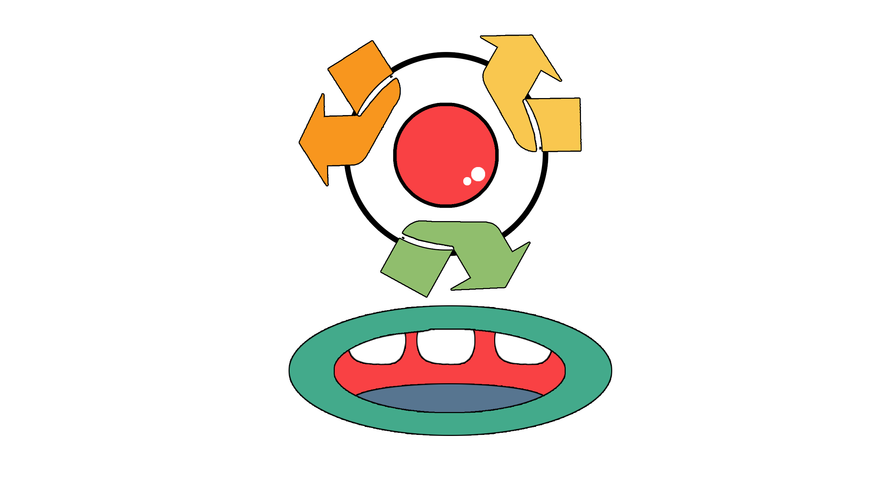

<!-- PROJECT LOGO -->
<br />
<p align="center">
  <a href="https://github.com/karanvirheer/Recyclops">
    
  </a>

  <h3 align="center">RECYCLOPS</h3>

  <p align="center">
    A waste image classifier that helps people sort their trash into the correct bins.
    <br />
    <a href="https://github.com/karanvirheer/Recyclops"><strong>Explore the docs »</strong></a>
    <br />
    <br />
    <a href="https://recyclops-machacks2021.herokuapp.com/">View Demo</a>
    ·
    <a href="https://github.com/karanvirheer/Recyclops/issues">Report Bug</a>
    ·
    <a href="https://github.com/karanvirheer/Recyclops/issues">Request Feature</a>
  </p>
</p>


<!-- TABLE OF CONTENTS -->
## Table of Contents

* [About the Project](#about-the-project)
  * [Built With](#built-with)
* [Getting Started](#getting-started)
  * [Prerequisites](#prerequisites)
  * [Installation](#installation)
* [Usage](#usage)
* [License](#license)
* [Contact](#contact)
* [Acknowledgements](#acknowledgements)

### Built With

* Javascript
* Node.js
* React
* HTML
* CSS


<!-- GETTING STARTED -->
## Getting Started

To get a local copy up and running follow these simple steps.

### Prerequisites

This is an example of how to list things you need to use the software and how to install them.
* npm
```sh
npm install npm@latest -g
```

* react
```sh
npm install react
```

* express
```sh
npm install express
```

* [node.js](https://nodejs.org/en/download/)

### Installation

1. Clone the repo
```sh
git clone https://github.com/karanvirheer/repo_name.git
```
2. Install NPM packages
```sh
npm install
```

<!-- USAGE EXAMPLES -->
## Usage

We propose a feasible solution of developing a smartphone application that allows users to take a picture of the trash that they are unsure of how or where to dispose of and instantly direct them to the correct method of disposal. This app would operates similar to Google Lens where users can just point their camera at an article of trash, and it would tell them which trash bin to throw it in and even give them tips for separating and cleaning it before throwing it out. This feature is powered by an integrated integrated model that is trained to classify varying trash articles, provide information on how it should be disposed of, and what precautions should be taken.

<!-- LICENSE -->
## License

Distributed under the MIT License. See `LICENSE` for more information.


<!-- CONTACT -->
## Contact

* Karanvir Heer - [@Karanvir_H](https://twitter.com/Karanvir_H)
* Saruggan Thiruchelvan - [@tsaruggan](https://github.com/tsaruggan)

<!-- ACKNOWLEDGEMENTS -->
## Acknowledgements

* [Teachable Machine](https://teachablemachine.withgoogle.com/)
* [TACO](https://github.com/pedropro/TACO)
